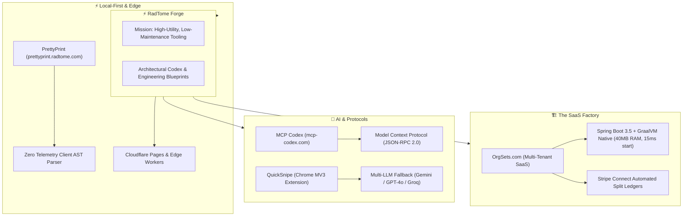

# ⚡ RadTome 📖

```text
 ██████╗  █████╗ ██████╗ ████████╗ ██████╗ ███╗   ███╗███████╗
 ██╔══██╗██╔══██╗██╔══██╗╚══██╔══╝██╔═══██╗████╗ ████║██╔════╝
 ██████╔╝███████║██║  ██║   ██║   ██║   ██║██╔████╔██║█████╗  
 ██╔══██╗██╔══██║██║  ██║   ██║   ██║   ██║██║╚██╔╝██║██╔══╝  
 ██║  ██║██║  ██║██████╔╝   ██║   ╚██████╔╝██║ ╚═╝ ██║███████╗
 ╚═╝  ╚═╝╚═╝  ╚═╝╚═════╝    ╚═╝    ╚═════╝ ╚═╝     ╚═╝╚══════╝
      THE DEFINITIVE BLUEPRINT FOR MODERN ENTERPRISE SYSTEMS
```

<p align="center">
  <a href="https://radtome.com"></a>
  <a href="https://radtome.github.io/.github/"></a>
  <a href="https://orgsets.com"></a>
  <a href="https://chromewebstore.google.com/detail/quicksnipe-1-click-listin/aignalgmmlmnmofabamcdngdopabgkaa"></a>
</p>

<p align="center">
  
  
  
  
  
  
</p>

---

# Welcome to the Tome. ⚡📖

**RadTome** is a software project organization and forge focused on **high-utility developer tooling**, **enterprise microservice architectures**, and **building the SaaS factory of the future**. 

We engineer the "boring" stuff—hardened multi-tenancy, zero-telemetry client computation, strict compliance vaults, GraalVM AOT native compilation, and edge infrastructure—so you can ship the "rad" stuff.

> 🌐 **Interactive Portal**: Explore live telemetry, project filters, and backlink codex on our [RadTome GitHub Pages Portal](https://radtome.github.io/.github/) or main site at [radtome.com](https://radtome.com).

---

### 🚀 Live Systems & Shipped Artifacts

RadTome builds and maintains verified production software across the web, edge, and browser extension ecosystems:

| System | Classification | Core Architecture | Live Target & Resources |
| :--- | :--- | :--- | :--- |
| **[OrgSets.com](https://orgsets.com)** | Production SaaS | Java 21, Spring Boot 3.5, GraalVM Native Images, React 19, MongoDB Materialized Paths, Stripe Connect | 🔗 [Visit OrgSets.com](https://orgsets.com)<br>🏢 Full-stack multi-tenant platform for hierarchical organizational management, democratic governance elections, automated Stripe Connect ledger auditing, and compliance vaults. |
| **[QuickSnipe](https://chromewebstore.google.com/detail/quicksnipe-1-click-listin/aignalgmmlmnmofabamcdngdopabgkaa)** | Chrome Extension | Manifest V3, SidePanel API, Gemini / OpenAI / Groq Fallback Routing, ExtensionPay | 🛒 [Chrome Web Store](https://chromewebstore.google.com/detail/quicksnipe-1-click-listin/aignalgmmlmnmofabamcdngdopabgkaa)<br>🛠️ [GitHub Support](https://github.com/RadTome/QuickSnipe-support)<br>AI listing studio, competitor sales velocity estimator, and review flaw miner for multi-channel resellers on Etsy, Depop, and eBay. |
| **[MCP Codex](https://mcp-codex.com)** | Directory & Blueprints | Model Context Protocol (MCP), Cloudflare Pages Edge, JSON-RPC 2.0, Claude & Agent Tooling | 🔗 [Visit MCP-Codex.com](https://mcp-codex.com)<br>🛠️ [GitHub Support](https://github.com/RadTome/mcp-codex-support)<br>Definitive developer directory and implementation blueprints for Model Context Protocol servers, connecting AI agents directly into production databases and APIs. |
| **[PrettyPrint](https://prettyprint.radtome.com)** | Local-First DevTool | 100% In-Browser AST Parser, Zero External Telemetry, React, Cloudflare Edge | ⚡ [Launch PrettyPrint](https://prettyprint.radtome.com)<br>Zero-telemetry developer utility for instantaneous recursive JSON and XML formatting and highlighting. No server hops, guarantees data privacy. |

---

### 📚 Architectural Codex & Engineering Dispatches

Deep technical blueprints, benchmarks, and production insights authored by RadTome engineering. Read the complete volumes on [radtome.com/articles](https://radtome.com/articles):

* **[High-Throughput Microservices: Java 21 & Spring Boot 3.5 GraalVM Native Images](https://radtome.com/articles/graalvm-spring-boot-3-native)**  
  *How Ahead-of-Time (AOT) compilation slashes memory usage to under 40MB and achieves sub-20ms cold starts in cloud container deployments.*
* **[Building Chrome Extensions Under Manifest V3: Service Workers & SidePanel API](https://radtome.com/articles/manifest-v3-chrome-extension-architecture)**  
  *Architecting persistent workspaces and multi-provider AI fallback pipelines with `chrome.storage.session` and stateless message passing.*
* **[Local-First Engineering: Why In-Browser JSON & Recursive XML Formatting Matters](https://radtome.com/articles/local-first-data-processing-prettyprint)**  
  *Eliminating compliance risks in developer tooling by running recursive parsing algorithms entirely client-side with zero telemetry.*
* **[Model Context Protocol (MCP) in Production: Bridging Autonomous Agents to Enterprise APIs](https://radtome.com/articles/model-context-protocol-enterprise-guide)**  
  *JSON-RPC 2.0 message flows, stdio vs. SSE transports, security sandboxing, and enterprise tool registration for Claude and LLM agents.*
* **[Building Ultra-Fast Edge Web Apps with React 19, Vite, and Cloudflare Pages](https://radtome.com/articles/react-19-cloudflare-edge-performance)**  
  *Prerendering with headless browser pipelines, immutable cache headers, and eliminating blocking waterfalls across global CDN nodes.*
* **[Multi-Tenant SaaS Architecture: Designing Hierarchical Node Trees in MongoDB & Redis](https://radtome.com/articles/multi-tenant-saas-hierarchical-nodes)**  
  *Modeling nested chapter trees with the Materialized Path pattern for O(1) query indexing and delegated enterprise permissions.*
* **[Building Automated Fee-Splitting & Compliance Ledgers with Stripe Connect](https://radtome.com/articles/stripe-connect-automated-ledger-splitting)**  
  *Multi-tier payment distribution, transfer groups, webhook idempotency, and immutable double-entry ledger bookkeeping.*

---

### 🗺️ Ecosystem Architecture



---

### 🛠️ The Tech Matrix

| Category | Primary Technologies | Production Utilization |
| :--- | :--- | :--- |
| **Backend & Native** | Java 21 LTS, Spring Boot 3.5.x, GraalVM AOT | Microsecond cold-starts, native Linux ELF binaries, low memory envelope |
| **Frontend & Web** | React 19, Vite, Tailwind CSS, Vanilla CSS | Edge-rendered SPA, zero layout shifts, high-density telemetry interfaces |
| **AI & Protocols** | Model Context Protocol (MCP), Gemini 2.5, OpenAI GPT-4o, Groq | Agentic tool execution, competitor listing analysis, real-time scraping |
| **Data & Storage** | MongoDB (Materialized Paths), Redis, Cloudflare KV | Hierarchical tenant trees, distributed locks, session persistence |
| **Fintech & Billing** | Stripe Connect Custom/Express, Transfer Groups | Double-entry ledgers, automated multi-tier dues splitting, webhook idempotency |
| **Browser Runtime** | Chrome Extensions Manifest V3, SidePanel API | Persistent background service workers, local session state storage |
| **Edge & Infra** | Cloudflare Pages/Workers, Fly.io, GitHub Actions, Docker | Global anycast deployment, automated CI/CD native compile matrix |

---

### 🏗️ Core Pillars

* **The SaaS Factory:** Reusable, production-tested blueprints for multi-tenant microservices, automated ledger routing, and edge-native deployments.
* **AI & Agentic Infrastructure:** Connecting LLMs to real-world codebases, browser automation, and MCP-compatible execution environments.
* **Rad Utilities:** Zero-overhead, developer-first tooling designed for engineers who value precision over polish.

---

### 🔮 "Is it a Book or an Opinion?"

**RadTome** exists at the intersection of a **Rad Tome** (a definitive manual of power) and software that is simply **Rad To Me** (highly opinionated, quality-driven code).

* **Rad** — from *Radical*. Bold. Unconventional. Unapologetic.
* **Tome** — a large, weighty, scholarly volume. Knowledge made permanent.
* **RadTome** — *Radical knowledge.* The tools worth keeping.

> "Tome" also reads as **"To Me"** — as in, *Rad To Me*. Built for the developers who get it.
>
> *"We think you're gonna like it here."*

---

<p align="center">
  <a href="https://radtome.com"><b>radtome.com</b></a> • 
  <a href="https://radtome.com/about"><b>About & Leadership</b></a> • 
  <a href="https://radtome.com/articles"><b>Articles & Codex</b></a> • 
  <a href="https://radtome.github.io/.github/"><b>GitHub Pages Portal</b></a> • 
  <a href="https://github.com/RadTome"><b>GitHub Organization</b></a>
</p>
<p align="center">
  <sub>Memphis, TN 🛠️ • Verified Systems Architecture & Editorial Leadership by Rad Tome</sub>
</p>
